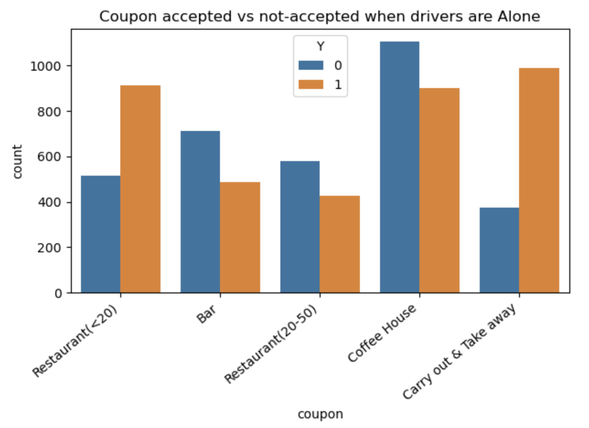
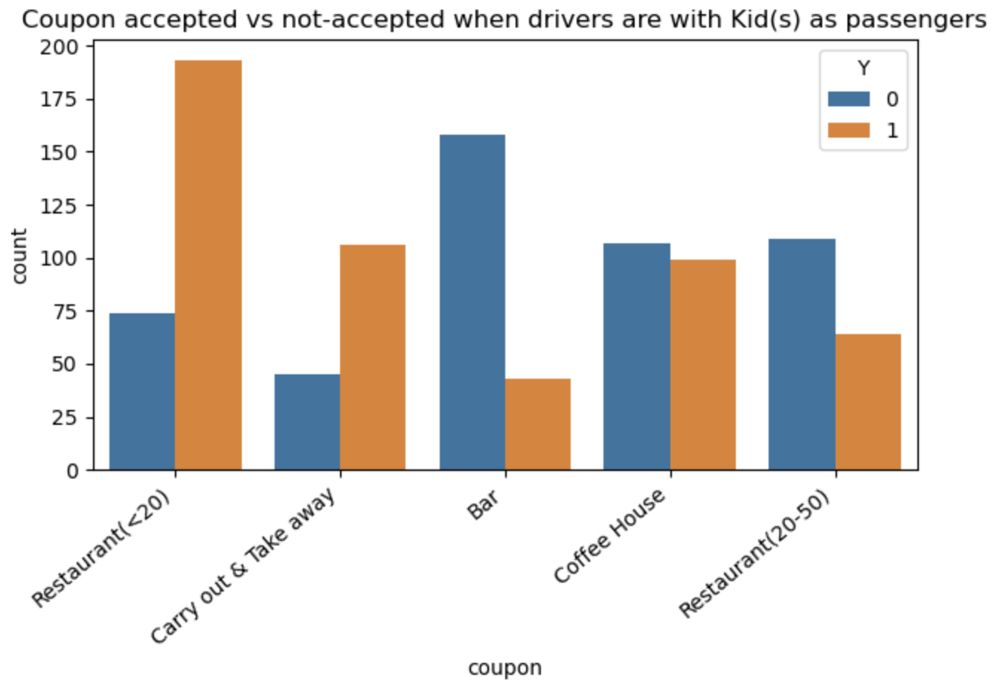
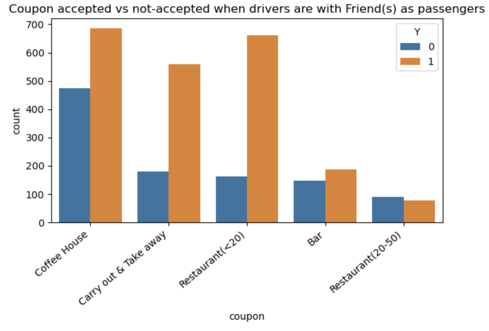
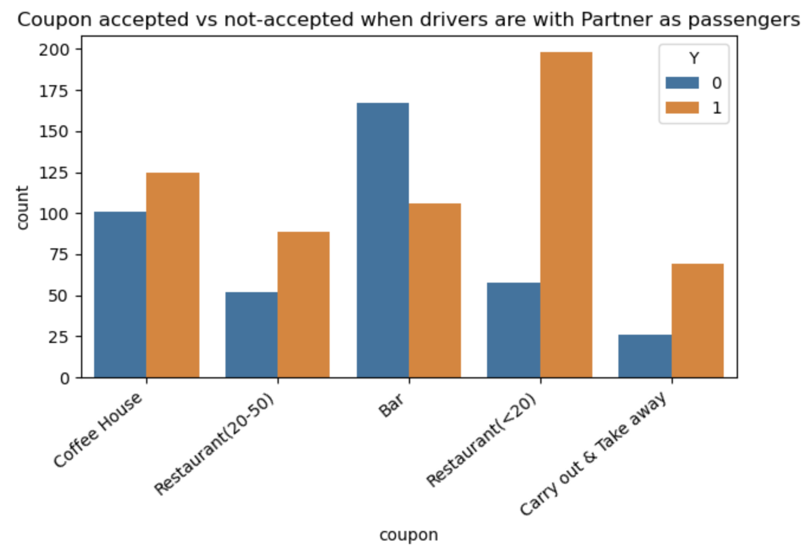
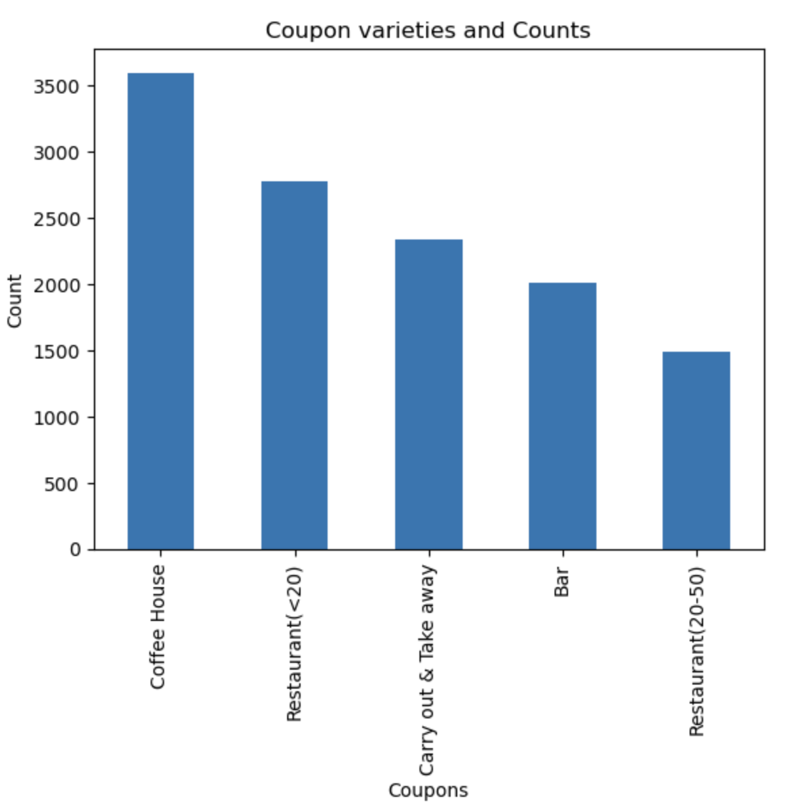

# Customer-Coupon-Acceptance

* The goal of the project is to find "if the customer accepts the coupon or not". The observation while doing the analysis are present in the below notebook.

         [Jupyter Notebook](https://github.com/kjvk/Customer-Coupon-Acceptance/blob/main/prompt.ipynb)

* There are certain columns like below, which doesn't have proper description/information or data. Also they are not required for the current targeted analysis, hence removed.
  
         * car
  
         * toCoupon_GEQ5min
  
         * toCoupon_GEQ15min
  
         * toCoupon_GEQ25mi columns

* Below are the columns which have missing values, the missing values were replaced with the Mode imputation mechanishm. This mechanism will replace the missing values with the more frequent 
  occuring data.
  
         * Car
  
         * Bar
  
         * CoffeeHouse
  
         * CarryAway
  
         * RestaurantLessThan20
  
         * Restaurant20To50
  
*  Acceptance of coupons by passengers

*  In almost all cases drivers have accepted coupons to Carry-out, Coffe House and Cheap reaturants. Out of which cheap-restaurants coupons are accepted most in every passenger sector.

*  Acceptance of coupons by drivers when they are alone. As stated above the Carry-out, Coffe House and Cheap reaturants coupons acceptance rate is more than the rest.

  

*  Acceptance of Bar coupons is minimal when drivers are with kids. Interestng factor is bar coupon acceptance rate is way smaller even with friends as passengers.

  

  

*  Drivers have accepted the Bar and Restaurant coupons widely when the passengers are their partners.

  

* Below is the histogram of summary of acceptance of coupons by variety of passengers.
* Drivers have accepted Carryout, Cheap-Restaurants and Coffehouse coupons more when they are Alone and with Friends. They have accpeted the Bar coupons in majority only when they are alone.

   

